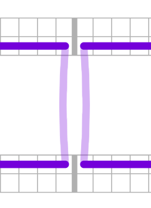
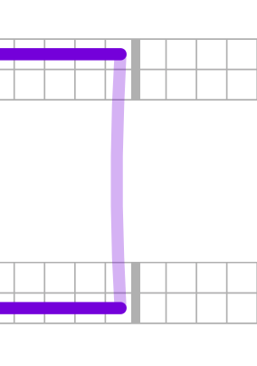
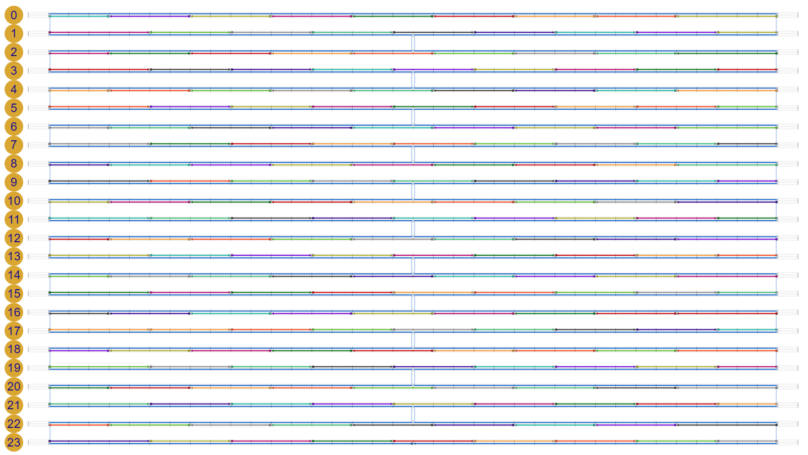
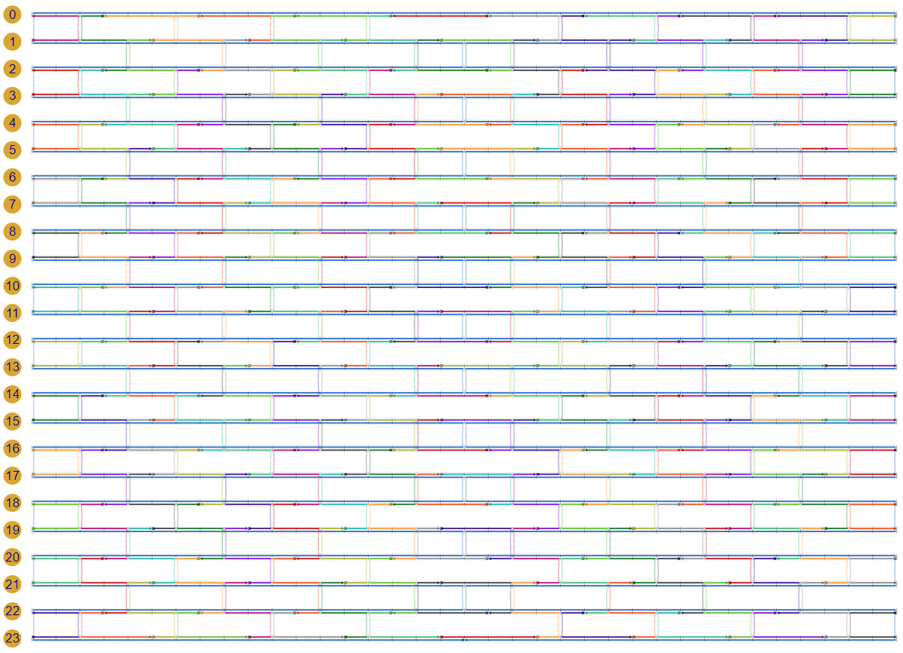
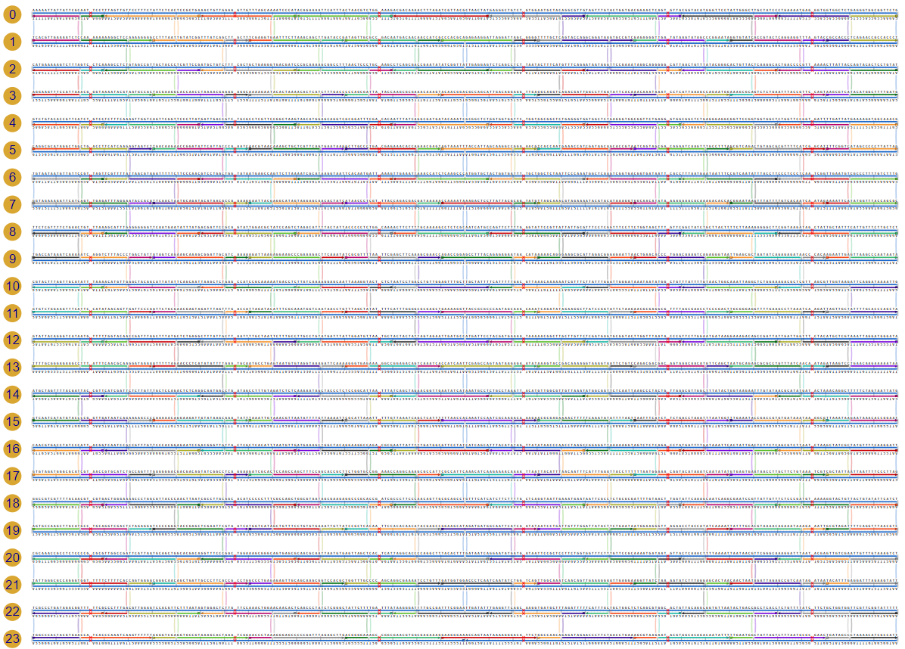

# scadnano Python scripting tutorial

The goal of this tutorial is to create a design for a 24-helix DNA origami rectangle, with "twist correction". (See [this paper](https://www.nature.com/articles/nchem.1070) for an explanation of twist correction in 2D DNA origami) 

See the [web interface tutorial](https://github.com/UC-Davis-molecular-computing/scadnano/blob/master/tutorial/tutorial.md) to see how to create this design manually in the scadnano web interface.


## Installation

First, follow the [installation instructions](../README.md#installation) to install the scadnano Python package.


## Viewing completed design

The design will look like this when we are done:


The completed design is available as a [`.sc` file](https://raw.githubusercontent.com/UC-Davis-molecular-computing/scadnano/master/web/examples/output_designs/24_helix_origami_rectangle_twist_corrected.sc) readable by scadnano. Download it and save it somewhere on your local file system.

To view it, first open scadnano in your browser: 
https://scadnano.org.
Currently only [Chrome](https://www.google.com/chrome/) 
or [Firefox](https://www.mozilla.org/en-US/firefox/)
are supported.

Select File&rarr;Open. Choose the file you downloaded. Alternatively, you can drag the file from your computer's file browser onto the open scadnano page in your web browser. The design should look similar to the first screenshot in the tutorial.


## Terminology and API

Before going further in this tutorial, please read through the help for the web interface, specifically the description of [terminology](https://github.com/UC-Davis-molecular-computing/scadnano#terminology). We will use the terms described there in the rest of this tutorial.

It will also be helpful to have available the [API documentation](https://scadnano-python-package.readthedocs.io). In this tutorial, we won't explain the full details of every function and method we use. If you wonder how it works, consult the API documentation.


## Create empty design

Now we will see how to create the design using the Python scripting package. 
We first note that the optional package [origami_rectangle](https://github.com/UC-Davis-molecular-computing/scadnano-python-package/blob/master/scadnano/origami_rectangle.py) can be used to create DNA origami rectangles, but for the purpose of this tutorial, we will see how to do it just using the scadnano Python package in [scadnano.py](https://github.com/UC-Davis-molecular-computing/scadnano-python-package/blob/master/scadnano/scadnano.py).

Create an empty text file named `24_helix_rectangle_twist_corrected.py`, and paste the following text into it:

```python
import scadnano as sc

def create_design():
    design = sc.Design(helices=[], strands=[], grid=sc.square)
    return design

if __name__ == '__main__':
    design = create_design()
    design.write_scadnano_file()
```

Run this file from the command line by opening a terminal window, changing directory to the location of the file `24_helix_rectangle_twist_corrected.py`, and typing 

```console
python 24_helix_rectangle_twist_corrected.py
```

Depending on your installation, you may have to type `python3` instead of `python`:

```console
python3 24_helix_rectangle_twist_corrected.py
```

In the same directory, a file named `24_helix_origami_rectangle_twist_corrected.sc` should appear. Open it in a text editor. The contents of the file should be something similar to this:

```json
{
  "version": "0.10.0",
  "helices": [],
  "strands": []
}
```

This is a file format called [JSON format](https://en.wikipedia.org/wiki/JSON). When using the web interface, it is not typically necessary to think about how the design is represented as JSON, but when using the scripting library, you may find yourself wanting to inspect the output while fixing bugs, so it is helpful to be familiar with how the design is represented. 


## Add helices

As you can see, the simple script we wrote generates a design with no helices and no strands. It is not necessary to specify helices specifically in the `Design` constructor; if they are omitted, then constructor infers which helices are present by inspecting the `Domain`'s of the `strands` parameter. But we will specify them explicitly in order to see how to customize their properties.

We want 24 helices. We need to ensure each helix has enough offsets for all the bases we will need. We will use a standard [M13mp18](https://www.ncbi.nlm.nih.gov/nuccore/X02513.1) scaffold strand, of length 7249. We won't use all of it, but we'll use most of it. Notice that 7249 / 24 &asymp; 302, so length 304 per helix is sufficient.

Change the Python file as follows. We marked the changed lines in `create_design()` with `###`:

```python
import scadnano as sc

def create_design():
    helices = [sc.Helix(max_offset=304) for _ in range(24)]         ###
    design = sc.Design(helices=helices, strands=[], grid=sc.square) ###
    return design

if __name__ == '__main__':
    design = create_design()
    design.write_scadnano_file()
```

To save space, below we will omit the `import scadnano as sc` statement and `if __name__ == '__main__'` block at the bottom, and we will write only the `create_design()` function, as well as any other functions it calls as we write them:

```python
def create_design():
    helices = [sc.Helix(max_offset=304) for _ in range(24)]
    design = sc.Design(helices=helices, strands=[], grid=sc.square)
    return design
```

Execute this script and inspect the output `24_helix_rectangle_twist_corrected.sc` file:

```json
{
  "version": "0.5.0",
  "helices": [
    {"max_offset": 304, "grid_position": [0, 0]},
    {"max_offset": 304, "grid_position": [0, 1]},
    {"max_offset": 304, "grid_position": [0, 2]},
    {"max_offset": 304, "grid_position": [0, 3]},
    {"max_offset": 304, "grid_position": [0, 4]},
    {"max_offset": 304, "grid_position": [0, 5]},
    {"max_offset": 304, "grid_position": [0, 6]},
    {"max_offset": 304, "grid_position": [0, 7]},
    {"max_offset": 304, "grid_position": [0, 8]},
    {"max_offset": 304, "grid_position": [0, 9]},
    {"max_offset": 304, "grid_position": [0, 10]},
    {"max_offset": 304, "grid_position": [0, 11]},
    {"max_offset": 304, "grid_position": [0, 12]},
    {"max_offset": 304, "grid_position": [0, 13]},
    {"max_offset": 304, "grid_position": [0, 14]},
    {"max_offset": 304, "grid_position": [0, 15]},
    {"max_offset": 304, "grid_position": [0, 16]},
    {"max_offset": 304, "grid_position": [0, 17]},
    {"max_offset": 304, "grid_position": [0, 18]},
    {"max_offset": 304, "grid_position": [0, 19]},
    {"max_offset": 304, "grid_position": [0, 20]},
    {"max_offset": 304, "grid_position": [0, 21]},
    {"max_offset": 304, "grid_position": [0, 22]},
    {"max_offset": 304, "grid_position": [0, 23]}
  ],
  "strands": []
}
```

At this point, and periodically throughout the tutorial, reload the file `24_helix_rectangle_twist_corrected.sc` in the scadnano web interface, to verify that it resembles the design you expect. (Recall that this can be done either by clicking File&rarr;Open or by dragging the file to the web browser opened to the scadnano site.) Unfortunately, since it is a browser-based application, there's no way to have it automatically reload whenever your local `24_helix_rectangle_twist_corrected.sc` file changes, for the same reason you wouldn't want arbitrary websites to start reading files on your computer without you explicitly uploading them.

At this point, the design should look like this:


## Add scaffold "precursor strands"

One can specify a design by explcitly listing every `Strand`, each of which is specified by listing every `Domain` (and if included, every `Loopout`). The point of a scripting library, however, is to automate tedious tasks by enabling a few loops to iterate over many of the `Strand`'s.

However, it can be difficult to see how to write a single loop, or even a small number of loops, to specify a complex design such as this one. An alternate simple way to specify a design is instead to visualize the design as consisting of several long strands, two per helix, which have had nicks and crossovers added. This is how we will design this DNA origami.

We do this by creating a "precursor" design, which is not the final design, and then editing it by adding nicks and crossovers, which is done by calling methods on the `Design` object.

The scaffold is a good starting point. It is one long strand, but we won't specify it as such. Instead, we will specify it by drawing one strand on each helix, spanning the full length, and then modifying these strands with nicks and crossovers, eventually joining them into one long strand.

Each `Strand` is specified primarily by a list of `Domain`'s, and each `Domain` is specified primarily by 4 fields: 
integer `helix` (actually, *index* of a helix),
boolean `forward` (direction of the `Domain`, i.e., is its 3' end at a higher or lower offset than its 5' end?),
integer `start` and `end` offsets.


```python
def create_design():
    design = precursor_scaffolds() ###
    return design

def precursor_scaffolds() -> sc.Design:
    helices = [sc.Helix(max_offset=304) for _ in range(24)]
    scaffolds = [sc.Strand([sc.Domain(helix=helix, forward=(helix % 2 == 0), start=8, end=296)])
                 for helix in range(24)]
    return sc.Design(helices=helices, strands=scaffolds, grid=sc.square)
```

Execute the script. The file `24_helix_origami_rectangle_twist_corrected.sc` is getting large now, so we won't show the whole thing, but the `strands` field should be non-empty now and start something like this:

```json
"strands": [
    {
      "color": "#f74308",
      "domains": [
        {"helix": 0, "forward": true, "start": 8, "end": 296}
      ]
    },
    {
      "color": "#57bb00",
      "domains": [
        {"helix": 1, "forward": false, "start": 8, "end": 296}
      ]
    },
    {
      "color": "#888888",
      "domains": [
        {"helix": 2, "forward": true, "start": 8, "end": 296}
      ]
    },
    {
      "color": "#32b86c",
...
```

The design should look like this:


## Aside: offsets are inclusive on the left and exclusive on the right

It is worth noting that the `start` and `end` offsets follow the standard programming convention of being inclusive for `start` and exclusive for `end`. In other words, for each of these strands, which all have `start`=8 and `end`=296, the set of offsets that each occupies is {8, 9, 10, ..., 294, 295}. This can be confusing, but it often makes code easier to think about. For example, setting the `end` of one strand to be equal to the `start` of another means that they are adjacent (i.e., appear to be one strand with a "nick" at the shared offset).


## Add nicks to scaffold

Currently, neither the [Python scripting library](https://github.com/UC-Davis-molecular-computing/scadnano-python-package/issues/14) nor the [web interface](https://github.com/UC-Davis-molecular-computing/scadnano/issues/5) for scadnano supports circular strands. However, if we add crossovers prematurely, we could mistakenly introduce a circular strand in an intermediate design, which would cause the script to raise an error. So generally it is best to add all the nicks we require first, to separate the strands as much as possible.

For the scaffold, we want nicks all along the "seam" (the offsets near the middle, other than the topmost helix). Since we are done writing the function `precursor_scaffolds()`, we will omit its definition from the code below:

```python
def create_design():
    design = precursor_scaffolds()

    add_scaffold_nicks(design) ###
    
    return design

def add_scaffold_nicks(design: sc.Design):
    for helix in range(1, 24):
        design.add_nick(helix=helix, offset=152, forward=helix % 2 == 0)
```


Now the design should look like this:


## Add crossovers to scaffold

Now we connect the scaffold into a single strand by adding crossovers. The "inner" crossovers (a.k.a., the "seam") are so-called *full crossovers*, meaning that *two* strands jump from one helix to the next, depicted here:



This contrasts a so-called *half crossover*, depicted here:



We add full crossovers at the seam and half crossovers at the left and right edges of the helices. Note that the offset specified for a full crossover is that of the half crossover on the right side.

Also, at this point the scaffold is a single strand, so we can call `set_scaffold()` to set it as the scaffold.

```python
def create_design():
    design = precursor_scaffolds()
    add_scaffold_nicks(design)

    add_scaffold_crossovers(design)  ###
    design.strands[0].set_scaffold() ###

    return design

def add_scaffold_crossovers(design: sc.Design):
    crossovers = []

    # scaffold interior: full crossovers
    for helix in range(1, 23, 2):
        crossovers.append(sc.Crossover(helix1=helix, helix2=helix + 1, offset1=152, forward1=False))

    # scaffold edges: half crossovers
    for helix in range(0, 23, 2):
        crossovers.append(sc.Crossover(helix1=helix, helix2=helix + 1, offset1=8, forward1=True, half=True))
        crossovers.append(sc.Crossover(helix1=helix, helix2=helix + 1, offset1=295, forward1=True, half=True))

    design.add_crossovers(crossovers)
```

There is a method `Design.add_crossover`, but we use the batch method `Design.add_crossovers`. This allows us to build up a list of `Crossover`'s first before adding them, which helps to avoid creating circular `Strand`'s in the intermediate stages.

Now the design should look like this:


## Add staple precursors

We added the scaffold precursor strands by giving them in the constructor for `Design`, but now the `Design` is created, so we cannot call the constructor again.

To add staples, we use the method `design.add_strand`. In general, modifying an existing design should always be done through methods rather than modifying the fields directly, although it is safe to access the fields read-only.

```python
def create_design():
    design = precursor_scaffolds()
    add_scaffold_nicks(design)
    add_scaffold_crossovers(design)
    design.strands[0].set_scaffold()

    add_precursor_staples(design) ###

    return design

def add_precursor_staples(design: sc.Design):
    staples = [sc.Strand([sc.Domain(helix=helix, forward=helix % 2 == 1, start=8, end=296)])
               for helix in range(24)]
    for staple in staples:
        design.add_strand(staple)
```

The design should now look like this:


## Add nicks to staples

The nicks are spacedly regularly between staples:

```python
def create_design():
    design = precursor_scaffolds()
    add_scaffold_nicks(design)
    add_scaffold_crossovers(design)
    design.strands[0].set_scaffold()
    add_precursor_staples(design)

    add_staple_nicks(design) ###

    return design


def add_staple_nicks(design: sc.Design):
    for helix in range(24):
        start_offset = 32 if helix % 2 == 0 else 48
        for offset in range(start_offset, 280, 32):
            design.add_nick(helix, offset, forward=helix % 2 == 1)
```

The design should now look like this:




## Add crossovers to staples

Since staples are now less connected than the scaffold was at this stage, we don't need to be as careful to avoid creating a circular strand, so we can add crossovers one at a time using repeated calls to the method `add_full_crossover`.

```python
def create_design():
    design = precursor_scaffolds()
    add_scaffold_nicks(design)
    add_scaffold_crossovers(design)
    design.strands[0].set_scaffold()
    add_precursor_staples(design)
    add_staple_nicks(design)

    add_staple_crossovers(design) ###

    return design

def add_staple_crossovers(design: sc.Design):
    for helix in range(23):
        start_offset = 24 if helix % 2 == 0 else 40
        for offset in range(start_offset, 296, 32):
            if offset != 152: # skip crossover near seam
                design.add_full_crossover(helix=helix, helix2=helix+1, offset=offset, forward=helix%2==1)
```

If you inspect carefully, you'll see that we are adding crossovers at offsets where nicks, i.e., 5'/3' ends of strands, do not exist already; the nicks are automatically created when calling `add_full_crossover`. This only works for `add_full_crossover`; the method `add_half_crossover` can only be given offsets corresponding to 5'/3' ends of strands.

The design is now mostly complete:




## Add deletions for twist correction

To achieve "twist correction" (See [this paper](https://www.nature.com/articles/nchem.1070) for an explanation of twist correction in 2D DNA origami), we add deletions every 3rd "column" of staples:

```python
def create_design():
    design = precursor_scaffolds()
    add_scaffold_nicks(design)
    add_scaffold_crossovers(design)
    design.strands[0].set_scaffold()
    add_precursor_staples(design)
    add_staple_nicks(design)
    add_staple_crossovers(design)

    add_deletions(design) ###

    return design


def add_deletions(design: sc.Design):
    for helix in range(24):
        for offset in range(27, 294, 48):
            design.add_deletion(helix, offset)
```

The design now looks like it did at the top:


## Assign DNA sequence to scaffold

Finally, we complete the design by assigning a DNA sequence to the scaffold, which will assign the complementary sequence to the appropriate staples. This is, in a sense, the primary function of [cadnano](https://cadnano.org/) and scadnano: to translate a desired abstract strand design, together with knowledge of a concrete DNA sequence for the scaffold, into the appropriate sequences for the staples to enable them to bind to the scaffold where we want. 

If you have a particular strand and sequence you would like to assign, you can call `design.assign_dna(strand, sequence)`. However, in the common case that your design has one scaffold, and you want to assign the sequence of [M13mp18](https://www.ncbi.nlm.nih.gov/nuccore/X02513.1) to it, there is a convenience method:

```python
def create_design():
    design = precursor_scaffolds()
    add_scaffold_nicks(design)
    add_scaffold_crossovers(design)
    design.strands[0].set_scaffold()
    add_precursor_staples(design)
    add_staple_nicks(design)
    add_staple_crossovers(design)
    add_deletions(design)

    design.assign_m13_to_scaffold() ###

    return design
```

If we load this design and check "show DNA" in the menu, we can see the full DNA sequence assigned:




## export DNA sequences

Finally, you will want to export the DNA sequences of the staples. One way to do this is simply to loop over the strands and print their sequences:

```python
for strand in design.strands:
    if strand != design.scaffold:
        print(strand.dna_sequence)
```

Or you could use Python's I/O library to write them to a file in a format of your choosing.

scadnano provides utility methods `write_idt_bulk_input_file` (for ordering in test tubes) and `write_idt_plate_excel_file` (for ordering in 96- or 384-well plates) for exporting to file formats recognized by the DNA synthesis company IDT ([Integrated DNA Technologies](https://www.idtdna.com/pages)). To use either method, each strand must have a field called `idt` set specifying the information that IDT expects, but we can call `strand.set_default_idt(use_default_idt=True)` to choose a reasonable default:

```python
def create_design():
    design = precursor_scaffolds()
    add_scaffold_nicks(design)
    add_scaffold_crossovers(design)
    design.strands[0].set_scaffold()
    add_precursor_staples(design)
    add_staple_nicks(design)
    add_staple_crossovers(design)
    add_deletions(design)
    design.assign_m13_to_scaffold()

    export_idt_plate_file(design) ###

    return design


def export_idt_plate_file(design: sc.Design):
    for strand in design.strands:
        if strand != design.scaffold:
            strand.set_default_idt(use_default_idt=True)
    design.write_idt_plate_excel_file(use_default_plates=True)
```

This will write an Excel file named `24_helix_origami_rectangle_twist_corrected.xls` readable by the web interface of IDT for used when ordering strands in 96-well plates: https://www.idtdna.com/site/order/plate/index/dna/1800

There are many options to customize how the strands are exported and what information goes into the `idt` field (e.g., purification, synthesis scale); see the [API documentation](https://scadnano-python-package.readthedocs.io/#scadnano.scadnano.Design.write_idt_plate_excel_file).


## complete script

The complete script is here:

```python
import scadnano as sc


def create_design():
    design = precursor_scaffolds()
    add_scaffold_nicks(design)
    add_scaffold_crossovers(design)
    design.strands[0].set_scaffold()
    add_precursor_staples(design)
    add_staple_nicks(design)
    add_staple_crossovers(design)
    add_deletions(design)
    design.assign_m13_to_scaffold()
    export_idt_plate_file(design)
    return design


def export_idt_plate_file(design: sc.Design):
    for strand in design.strands:
        if strand != design.scaffold:
            strand.set_default_idt(use_default_idt=True)
    design.write_idt_plate_excel_file(use_default_plates=True)


def add_deletions(design: sc.Design):
    for helix in range(24):
        for offset in range(27, 294, 48):
            design.add_deletion(helix, offset)


def add_staple_crossovers(design: sc.Design):
    for helix in range(23):
        start_offset = 24 if helix % 2 == 0 else 40
        for offset in range(start_offset, 296, 32):
            if offset != 152:  # skip crossover near seam
                design.add_full_crossover(helix=helix, helix2=helix + 1, offset=offset,
                                          forward=helix % 2 == 1)


def add_staple_nicks(design: sc.Design):
    for helix in range(24):
        start_offset = 32 if helix % 2 == 0 else 48
        for offset in range(start_offset, 280, 32):
            design.add_nick(helix, offset, forward=helix % 2 == 1)


def add_precursor_staples(design: sc.Design):
    staples = [sc.Strand([sc.Domain(helix=helix, forward=helix % 2 == 1, start=8, end=296)])
               for helix in range(24)]
    for staple in staples:
        design.add_strand(staple)


def precursor_scaffolds() -> sc.Design:
    helices = [sc.Helix(max_offset=304) for _ in range(24)]
    scaffolds = [sc.Strand([sc.Domain(helix=helix, forward=helix % 2 == 0, start=8, end=296)])
                 for helix in range(24)]
    return sc.Design(helices=helices, strands=scaffolds, grid=sc.square)


def add_scaffold_nicks(design: sc.Design):
    for helix in range(1, 24):
        design.add_nick(helix=helix, offset=152, forward=helix % 2 == 0)


def add_scaffold_crossovers(design: sc.Design):
    crossovers = []

    # scaffold interior
    for helix in range(1, 23, 2):
        crossovers.append(sc.Crossover(helix1=helix, helix2=helix + 1, offset1=152, forward1=False))

    # scaffold edges
    for helix in range(0, 23, 2):
        crossovers.append(sc.Crossover(helix1=helix, helix2=helix + 1, offset1=8, forward1=True, half=True))
        crossovers.append(
            sc.Crossover(helix1=helix, helix2=helix + 1, offset1=295, forward1=True, half=True))

    design.add_crossovers(crossovers)


if __name__ == '__main__':
    design = create_design()
    design.write_scadnano_file()
```
